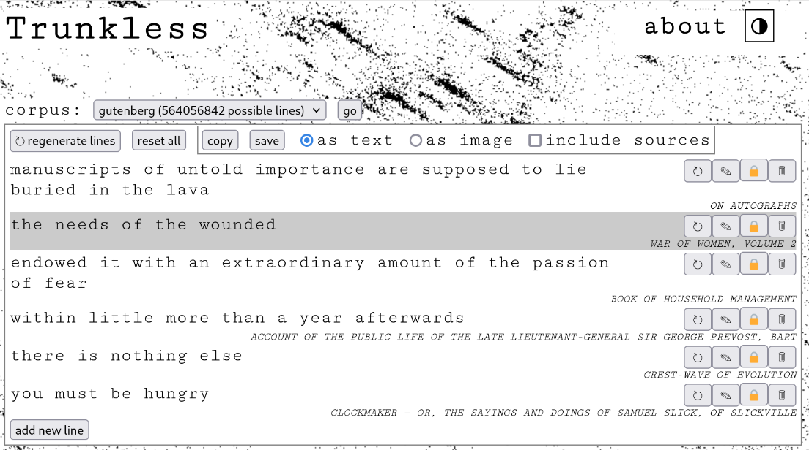

# Trunkless

_being a web-based tool for making cut-up poetry using very large corpora_

Trunkless is a spiritual successor to [prosaic](https://github.com/vilmibm/prosaic).

This repository contains code for:

- processing source material
- inserting cutup phrases into `postgresql`
- hosting a web front-end

If you are very brave you can run Trunkless yourself; otherwise, check out the version [I host](https://trunkless.tilde.town).

To learn more, check out [this blog post](https://tilde.town/~vilmibm/blog/#announcing-trunkless).
